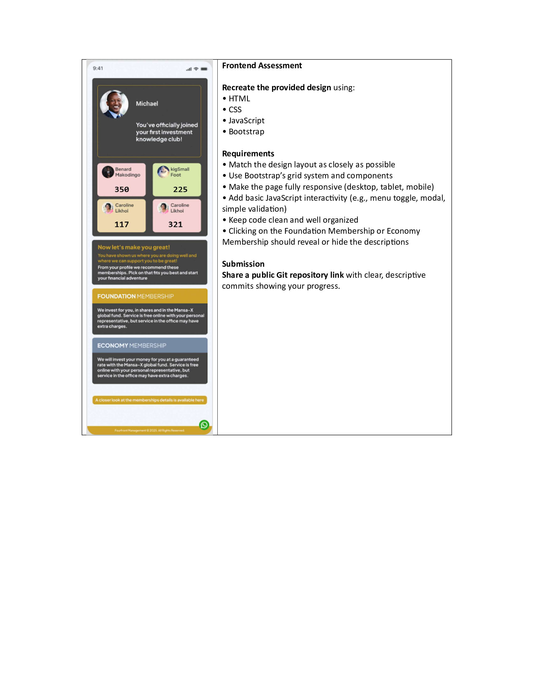
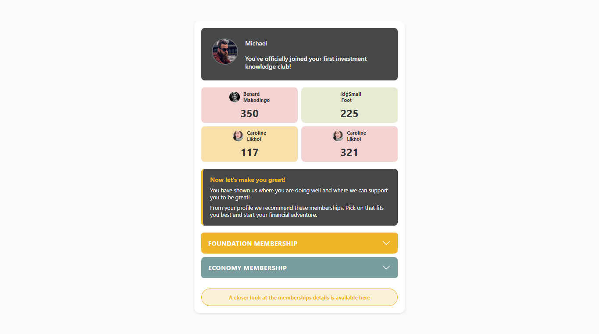

# Money Tracker Assessment Project

This repository contains the full-stack implementation for the Money Tracker Assessment. The project is divided into two main components: a Laravel-based Backend API and a Frontend application based on the provided/shared pdf.

## Project Structure

- **[backend/](backend/)**: A RESTful API built with PHP Laravel and MySQL. It manages users, wallets, and transactions with dynamic balance calculations.

- **[frontend/](frontend/)**: A different application not related to the money tracker with the following screenshots

 - original file

 - modified file

---
**[frontend/](frontend/)**: only implemented the mobile view approach 

## Getting Started

### Backend Setup
For detailed setup instructions, API documentation, and Postman testing steps, please refer to the **[Backend README](backend/README.md)**.

**Quick Start:**
1. Navigate to `backend/`.
2. Configure your `.env` for MySQL.
3. Run `composer install` and `php artisan migrate`.
4. Start the server with `php artisan serve`.

## Key Features

- **User Management**: Create and view user profiles.
- **Multi-Wallet Support**: Users can own multiple wallets (e.g., Business, Personal).
- **Transaction Tracking**: Record income and expenses for specific wallets.
- **Dynamic Balances**: 
    - Individual wallet balances are calculated based on transactions.
    - User overall balance is calculated across all associated wallets.

## Submission Documents
- [Backend Submission.pdf](Backend%20Submission.pdf)
- [Frontend Submission.pdf](Frontend%20Submission.pdf)
