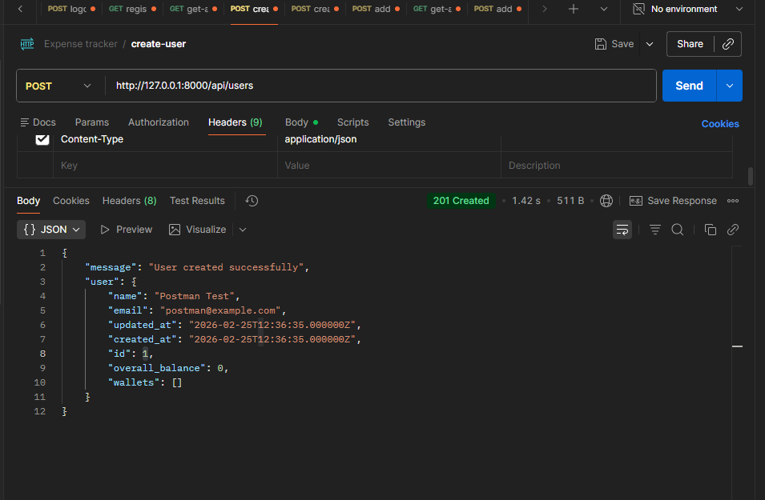
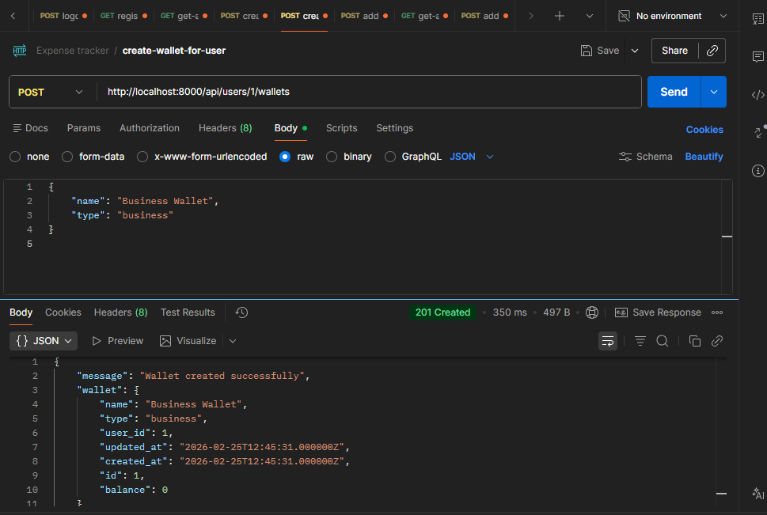
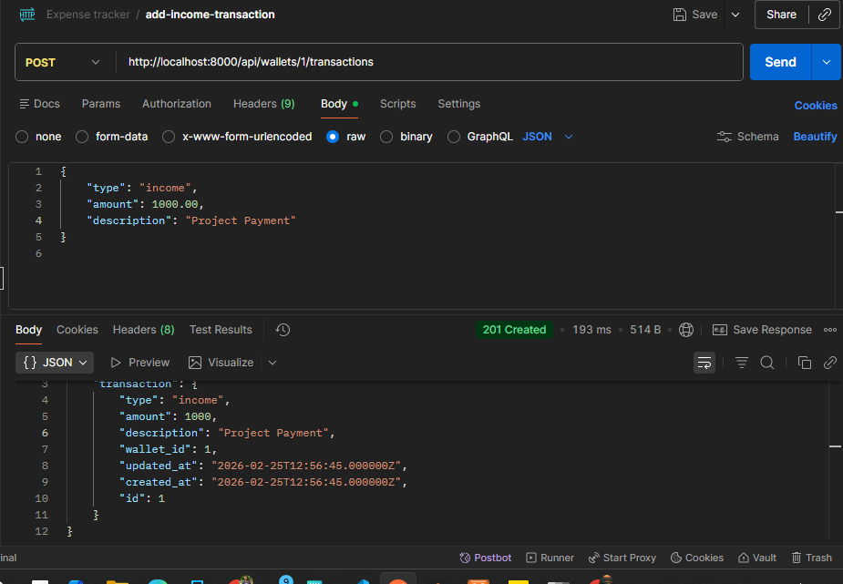
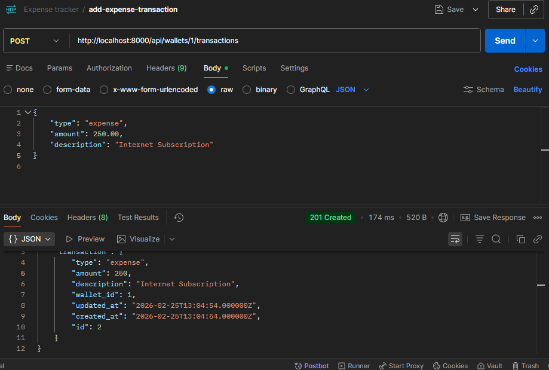
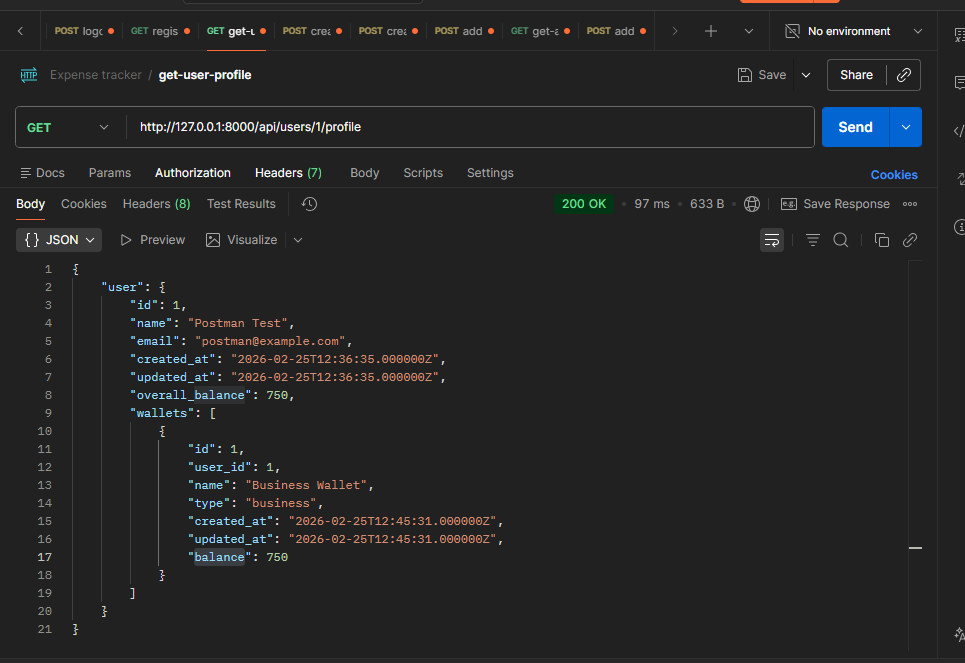

# Money Tracker API Assessment

This is the backend API for the Money Tracker assessment built with PHP Laravel and MySQL database.

## Setup Instructions

1.  **Clone the repository** (if applicable).
2.  **Environment Setup**:
    *   Navigate to the `backend` directory.
    *   Ensure your `.env` file is configured. This project uses **MySQL** for ease of testing.
3.  **Install Dependencies**:
    ```bash
    composer install
    ```
4.  **Run Migrations**:
    ```bash
    php artisan migrate
    ```
5.  **Start the Server**:
    ```bash
    php artisan serve
    ```
    The API will be available at `http://localhost:8000/api`.

---

## API Testing with Postman (Step-by-Step)

Follow these steps in order to test the full functionality of the API.

### 1. Create a User Account
*   **Method**: `POST`
*   **URL**: `http://localhost:8000/api/users`
*   **Body (JSON)**:
    ```json
    {
        "name": "Postman Test",
        "email": "postman@example.com"
    }
    ```
*   **Note**: Save the `id` from the response (e.g., `1`).

```markdown

``

### 2. Create a Wallet
*   **Method**: `POST`
*   **URL**: `http://localhost:8000/api/users/1/wallets` (replace `1` with your User ID)
*   **Body (JSON)**:
    ```json
    {
        "name": "Business Wallet",
        "type": "business"
    }
    ```
*   **Note**: Save the `id` from the response (e.g., `1`).

```markdown

``

### 3. Add an Income Transaction
*   **Method**: `POST`
*   **URL**: `http://localhost:8000/api/wallets/1/transactions` (replace `1` with your Wallet ID)
*   **Body (JSON)**:
    ```json
    {
        "type": "income",
        "amount": 1000.00,
        "description": "Project Payment"
    }
    ```

```markdown

```

### 4. Add an Expense Transaction
*   **Method**: `POST`
*   **URL**: `http://localhost:8000/api/wallets/1/transactions`
*   **Body (JSON)**:
    ```json
    {
        "type": "expense",
        "amount": 250.00,
        "description": "Internet Subscription"
    }
    ```

```markdown

```

### 5. View Specific Wallet (Balance & History)
*   **Method**: `GET`
*   **URL**: `http://localhost:8000/api/wallets/1`
*   **Description**: Returns the wallet balance (Calculated: Income - Expense) and all transactions.

```markdown
![screenshots/get-wallet.png]
```

### 6. View User Profile (Overall Balance)
*   **Method**: `GET`
*   **URL**: `http://localhost:8000/api/users/1/profile`
*   **Description**: Returns all user wallets with their individual balances and the **total overall balance** across all wallets.

---
 
 ```markdown

```


## Technical Details

- **Architecture**: Standard Laravel MVC (Resources modularized in API Controllers).
- **Database**: MySQL (configured in `.env`).
- **Relationships**: 
    - User has many Wallets.(which means a user can have multiple wallets and a wallet belongs to a user)`Relationship:one to many`

    - Wallet has many Transactions.(which means a wallet can have multiple transactions and a transaction belongs to a wallet)`Relationship:one to many`

- **Derived Logic**: Balances are calculated dynamically using Eloquent relationship sums.Instead of using raw DB facades or queries.
